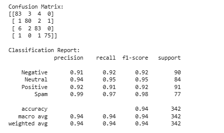

# 💬 Comment Sentiment Classification

## 📌 Giới thiệu
Bài toán **phân loại cảm xúc bình luận bất động sản** nhằm xác định thái độ của người dùng trong các bình luận liên quan đến nhà đất.  
Mỗi bình luận được phân loại vào một trong bốn nhóm cảm xúc.

## 🎯 Mục tiêu
Xây dựng mô hình Machine Learning để phân loại bình luận thành các nhãn:
- **Negative**: Bình luận tiêu cực
- **Neutral**: Bình luận trung lập / hỏi thông tin
- **Positive**: Bình luận tích cực
- **Spam**: Bình luận quảng cáo, không liên quan

## 📊 Dữ liệu
- Ngôn ngữ: **Tiếng Việt**
- Số lượng: khoảng **5.000 bình luận**
- Định dạng: CSV
- Các cột chính:
  - `Bình luận`: nội dung văn bản
  - `Sentiment Label`: nhãn cảm xúc

Ví dụ dữ liệu:
| Bình luận | Sentiment Label |
|---------|----------------|
| Nhà mới xây, nội thất đẹp | Positive |
| Bên em chuyên mua bán nhà đất giá rẻ | Spam |

## 🔄 Tiền xử lý
- Chuẩn hóa nhãn sang dạng số:
  - Negative → 0
  - Neutral → 1
  - Positive → 2
  - Spam → 3
- Chia tập dữ liệu:
  - 80% training
  - 20% testing (stratify theo nhãn)

## 🤖 Mô hình sử dụng
- **TF-IDF**: Trích xuất đặc trưng văn bản (unigram + bigram)
- **Linear SVM**:
  - Phù hợp với dữ liệu văn bản có số chiều lớn
  - Huấn luyện nhanh, hiệu quả tốt với tập dữ liệu vừa và nhỏ

## ⚙️ Công nghệ
- Python
- Scikit-learn
- Pandas, NumPy
- Joblib (lưu model)

## 📈 Đánh giá mô hình
Các chỉ số đánh giá:
- Accuracy
- Precision
- Recall
- F1-score
- Confusion Matrix

Kết quả tổng thể

